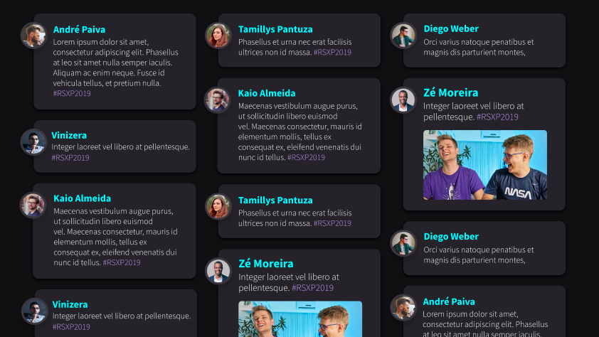

# API RSXP

## Descrição:
API para Social Wall do Twitter apresentado no workshop do evento da Rocketseat na RSXP

## Print:
Um print do sistema.


## Iniciando

### Pré-requisitos

- NodeJs > 10

### Instalando

### Windows, Linux e MacOS

Faça o fork desse repositório para o sub-grupo do projeto que está desenvolvendo.

```
git clone https://github.com/calleufuzi/api-rsxp
```

Crie as branchs manualmente ou utilize o git flow:

GIT FLOW
 - Para instalar e usar o git flow acesse o [link](https://danielkummer.github.io/git-flow-cheatsheet/index.pt_BR.html).


MANUALMENTE
- Crie as branch master e develop
```
> git checkout -b master
> git push origin master

> git checkout -b develop
> git push origin develop
```

### Configurando
Preencha os arquivos de configuração na pasta "config" com as informações dos serviços usados pelo projeto.

Crie o arquivo development.env dentro da pasta .env e preecha-o com as configurações necessárias usando .env.example como exemplo.

Execute os seguintes comandos:
```
> npm install or yarn
```

### Rodando
```
> npm start ou yarn start
```

### Rodando com nodemon
```
> npm devstart ou yarn devstart
```

### Acessando a api
```
localhost:'porta-configurada no development.env'
localhost:3000/health
```

### Estrutura de pastas

Abaixo segue a estrutura de pastas do projeto.

    .
    ├── .vscode                   # Folder with the configuration files to run debug mode in the VS Code IDE.
    ├── bin                       # Folder with www file responsible for start web server.
    ├── config                    # Folder with the configuration files for run project.
    ├── controllers                    # Folder with the controllers of the project
    ├── env                       # Folder with the environment variables files. (e.g database, aws services)
    ├── helpers                   # Folder with the helpers files.
    ├── middlewares               # Folder with the middlewares files to use before executing the routes.
    ├── node_modules              # Folder with project modules.
    ├── public                    # Folder with public files (e.g assets, js, css).
    ├── routes                    # Folder with the routes files from project.
    ├── services                  # Folder with services used by project (aws, google, azure, twitter).
        ├── aws
        └── twitter
    ├── views                     # Folder with views (e.g ejs, html).
    ├── .gitignore
    ├── app                       # Entrypoint for project.
    ├── package.json
    ├── pm2.json                  # PM2 configuration file to start project.
    └── readme.md


## Autor(res)

* **Calleu Fuzi - calleu.fuzi@tvglobo.com.br**
* **Filipe Macedo - filipe.macedo@tvglobo.com.br**
* **Vinicius Alcantara - vinicius.alcantara@tvglobo.com.br**

